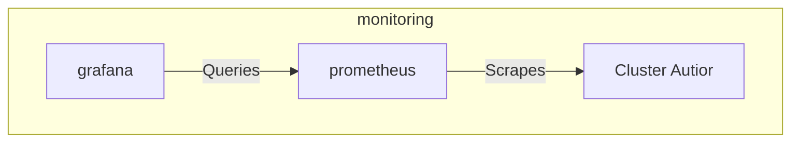

# Cluster Auditor

## Overview

Cluster Auditor(CA) pulls data from the kubernetes API, transforms them into consumable metrics that Promtheus scrapes and Grafana displays.

## Big Bang Touch Points

## High Availability

CA currently does not support HA.

## Storage

Cluster Auditor violations are scraped by Prometheus, so leverage the storage solution provided by Prometheus.

## Single Sign On (SSO)

CA does not have SSO Integration, but violations can be viewed in Grafana and can leverage SSO in Grafana.

## Licensing

CA is [Apache License 2.0](https://github.com/fluent/fluentd/blob/master/LICENSE).

## Dependant Packages

- Monitoring
- OPA Gatekeeper
