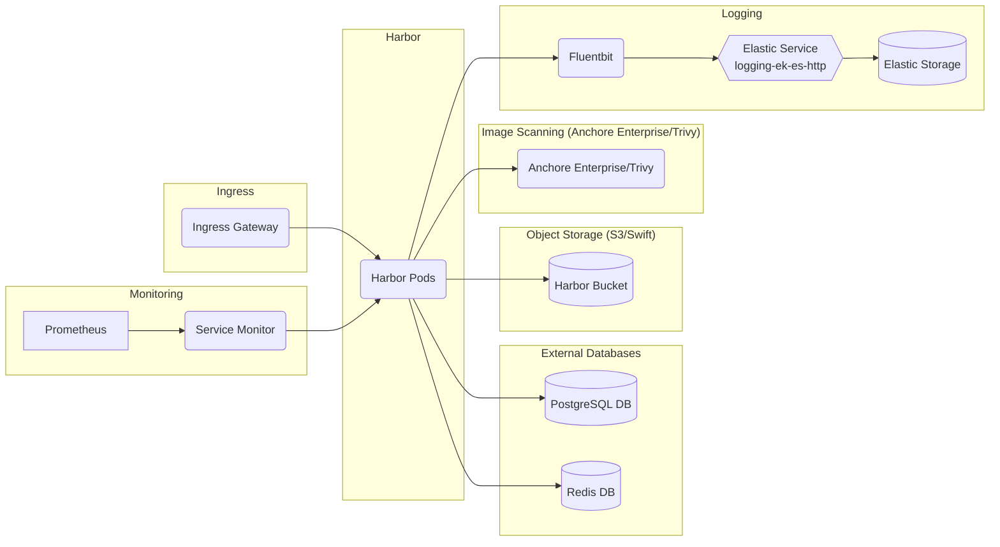

# Harbor

## Overview

[Harbor](https://goharbor.io/) is an open source registry that secures artifacts with policies and role-based access control, ensures images are scanned and free from vulnerabilities, and signs images as trusted.

### Harbor



For more information on the Harbor architecture, see [Harbor Overview and Architecture](https://github.com/goharbor/harbor/wiki/Architecture-Overview-of-Harbor).

## Big Bang Touch Points

### Storage

By default Harbor uses local storage for the registry, but you can optionally configure the storage_service setting so that Harbor uses external storage.

See below for an example of the values to provide an external storage backend for Harbor:

```yaml
addons:
  harbor:
    values:
      s3:
        # Set an existing secret for S3 accesskey and secretkey
        # keys in the secret should be AWS_ACCESS_KEY_ID and AWS_SECRET_ACCESS_KEY for chartmuseum
        # keys in the secret should be REGISTRY_STORAGE_S3_ACCESSKEY and REGISTRY_STORAGE_S3_SECRETKEY for registry
        #existingSecret: ""
        region: us-west-1
        bucket: bucketname
        #accesskey: awsaccesskey
        #secretkey: awssecretkey
        #regionendpoint: http://myobjects.local
        #encrypt: false
        #keyid: mykeyid
        #secure: true
        #skipverify: false
```

### High Availability

Reference the [Harbor High Availability Guide](https://repo1.dso.mil/big-bang/apps/sandbox/harbor/-/blob/main/chart/docs/High%20Availability.md) for an overview of a harbor high availability deployment.

See below for an example of the values to provide high availability for harbor:

```yaml
addons:
  harbor:
    values:
      portal:
        replicas: 2
      core:
        replicas: 2
      jobservice:
        replicas: 2
      registry:
        replicas: 2  
      chartmuseum:
        replicas: 2
      clair:
        replicas: 2
      notary:
        server:
          replicas: 2  
      notary:
        server:
          replicas: 2    
```

### UI

Harbor includes a UI, which is accessible at a configurable URL. The UI can be used to view, manage, and create applications.

Harbor is Istio injected and the VirtualService resource is accessible externally from the cluster at "harbor.{{ .Values.domain }}" but can be configured via the following values in the bigbang chart:

```yaml
domain: bigbang.dev
istio:
  enabled: true
  harbor:
    # -- Toggle Istio VirtualService creation
    enabled: true
    # -- Set Gateway for VirtualService
    gateways:
    - "istio-system/public"
    # -- Set Hosts for VirtualService
    hosts:
    - "harbor.{{ .Values.domain }}"
```

### Logging

Harbor keeps a log of all of the operations that users perform in a project. You can apply filters to help you to search the logs. By default, Harbor tracks all image pull, push, and delete operations performed and keeps a record of these actions in a database. Harbor offers the ability to manage audit logs by configuring an audit log retention window and setting a syslog endpoint to forward audit logs.

_Note:_ within Big Bang, logs are captured by fluentbit and shipped to elastic by default.

### Monitoring

Harbor exposes prometheus metrics in the API of each service if the config.yaml used by that service has the metrics.enabled keys set to enabled. Each service exports its own metrics and is typically scraped by a Prometheus installation to gather the metrics.

The Big Bang Anchore Helm chart has been modified to use your `monitoring:` values in Big Bang to automatically toggle metrics on/off.

### Dependent Packages

- PostgreSQL 9.6+ (in-cluster by default; can be configured to use an external postgres)
- Redis (in-cluster by default; can be configured to use an external redis)
