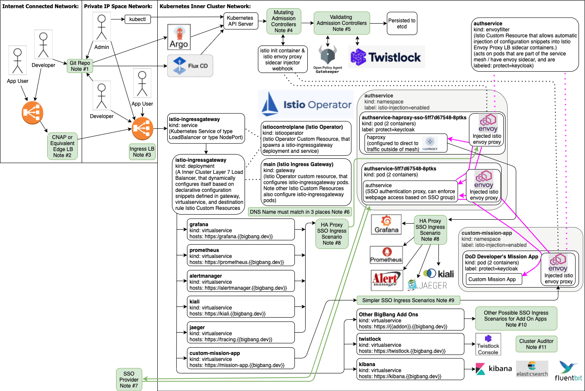

# Goals of this Architecture Diagram: 
* Show a zoomed in view of BigBang Core
* Help new users better understand:
  * How traffic flows into the cluster
  * How BigBang is leveraging Istio Operator
  * How web sites hosted on BigBang are protected by an SSO Authentication Proxy
  * Internet vs LAN vs Inner Cluster Network
    * How sites are generally exposed via Istio Ingress Gateway
    * That sometimes there are services existing on the Inner Cluster Network that are not reachable outside of the Inner Cluster Network

## Notice:
* The intent of this Architecture Diagram is to: 
  * Act as a starting point upon which further understanding can be built
  * Improve a users understanding of BigBang components fit together, so that if the user needs to modify components or data flows to fit their usecase they'll have an idea of what the modification might look like
  * Show potential use cases for some of BigBang's core components
* This Architecture Diagram is NOT intended to:
  * Reflect an accurate default configuration
  * Perscriptively say you must do things this way 
* This Architecture Diagram should be taken with a grain of salt:       
  It's difficult to make a generic diagram with high accuracy. BigBang's Helm Values are variables, some values can produce significantly different traffic flows, the same can be said of SSO and Load Balancer Implementation options. Nuances specific to the deployment environment and hardened configurations like SELinux & Istio CNI can effect the implementation. 

# BigBang Network Ingress Diagram:

## Notes:  
### 1. Git Repo:  
* Can be HTTPS or SSH based, can exist on the Internet or in Private IP Space
* Argo CD / Flux CD need network access and in most cases credentials to authenticate against the repo.

### 2. CNAP or Equivalent Edge LB: 
* More details can be found on the [Ask Me Anything Slides located here](https://software.af.mil/dsop/documents/), but the CNAP is basically an advanced edge firewall.
* Platform One's CNAP involves a public Cloud Service Provider LB forwarding traffic to a Palo Alto Firewall then to an AppGate Software Defined Perimeter and then to the Private IP of a CSP LB / Ingreses LB of a Kubernetes Cluster running the BigBang Application Stack. 
* CNAP is NOT part of BigBang, and there is no hard requirement that says you need to use CNAP. 
  * In cases where users will be connecting purely over private IP space CNAP isn't needed.
  * Your own CNAP equivalent may be used in place of P1's CNAP.
  * If your DoD command is interested in leveraging P1's CNAP + P1's Common Access Card Integrated SSO with your own BigBang Cluster that can be arranged with VPC peering [this page has instructions on how to ask for more details](https://p1.dso.mil/#/services)

### 3. Ingress LB:      
* Istiocontrolplane IstioOperator Custom Resource will spawn a Kubernetes service of type Load Balancer, which spawns a CSP LB. 
* Most deployments of BigBang should be configured to spawn a CSP LB with a Private IP Address.
* Traffic Flow:
  1. Port 443 of the Cloud Service Provider Load Balancer gets load balanced between a NodePort of the worker nodes. (The NodePort can be randomly generated or static, depending on helm values.)
  2. Kube Proxy then maps the NodePort, which is accessible on the Private IP Space Network, to port 443 of the istio-ingressgateway service which is accessible on the Kubernetes Inner Cluster Network. (So Kube Proxy and Node Ports are how traffic crosses the boundary from Private IP Space to Kubernetes Inner Cluster Network Space.)
  3. Istio-ingressgateway service port 443 then maps to port 8443 of istio-ingressgateway pods (they use the non-privileged port 8443, because they've gone through the IronBank Container hardening process. (That being said from the end users perspective the end user only sees 443.) use IronBank Containers.)
  4. The Istio Ingress Gateway pods are basically Envoy Proxies / Layer 7 Load Balancers that are dynamically configured using declarative Kubernetes Custom Resources managed via GitOps. These Ingress Gateway pods forward traffic to websites hosted in the BigBang Cluster / expose websites hosted in a BigBang Cluster.
* It's possible to seperate different types of traffic by using more than 1 CSP LB, istiooperator, and Istio Ingress Gateway
* It's possible to logically seperate admin and user traffic using a single CSP LB. It can expose both admin facing websites like kibana.bigbang.dev and user facing websites like gitlab.bigbang.dev. An SSO Authentication Proxy and Identity Provider groups can be used to make it so only users in certain groups can be routed to webpages intended for admins. 

### 4. Mutating Admission Controllers
* Istiod pod hosts this functionality of the sidecar injector webhook that mutates pod YAML to add istio init containers and envoy proxy sidecar containers to pods that need to be integrated into the service mesh. 
* It's possible to use Istio CNI plugin to eliminate the need for istio init containers.

### 5. Validating Admission Controllers
* Open Policy Agent Gatekeeper and Twistlock can be used as Validating Admission Controls; however, by default Twistlock is disabled as it requires a license and OPA GK defaults to dryrun/warning instead of blocking/enforcing. 

### 6. DNS Name must match in 3 places
* *.bigbang.dev is the default helm value for website URLs hosted on a BigBang cluster (the value is overridable)
  1. The DNS Name must eventually get redirected to the Ingress LB
  2. The BigBang Virtual Services must have the same DNS Name
  3. The Istio Ingress Gateway will reference a Kubernetes Secret containing a HTTPS certificate, the DNS Name associated with that certificate has to match.
* If these 3 don't match, users will see errors when trying to access the sites. 

### 7. SSO Provider
* BigBang is designed to integrate with an external SSO Provider; it should work with any OIDC compliant SSO solution. 
* Example Scenario: 
  * Authorized user and random person on the internet both self register with P1 SSO https://login.dso.mil/      
  * The Authorized User either has a .mil email domain or links their CAC Card to an arbitrary email, and gets assigned a group.      
  * The other user with an arbitrary email gets put into a Randos group with limited access. 
  * Both users notice a https://confluence.il2.dso.mil link on the https://p1.dso.mil/#/products/big-bang/ website. 
  * The authorized user can access *.il2.dso.mil, repo1.dso.mil, and registry1.dso.mil
  * The rando user can't access il2, but can access repo1 and registry1.
* Currently the most supported SSO Implementation of BigBang is to leverage P1's SSO. 
* The CNAP Team can provide OIDC Credentials to allow your instance of BigBang to integrate with P1's SSO, and allow you to control who can access a site hosted on the cluster.
* P1 is working on a deployable KeyCloak solution, [status of the feature is being tracked here](https://repo1.dso.mil/groups/platform-one/big-bang/-/issues?scope=all&utf8=%E2%9C%93&state=opened&search=keycloak). 

### 8. HA Proxy SSO Ingress Scenario: 
1. Human Visits: https://grafana.bigbang.dev
2. Istio-Ingress Gateway Directs traffic destined for that URL to the Istio Envoy Proxy of HA Proxy's Pod
3. Because HA Proxy's pod is labeled protect=keycloak, an envoyfilter injects additional configuration into the Envoy Proxy, which configures it to redirect incoming traffic to the Auth Service SSO Authentication Proxy
4. Auth Service redirects the user to https://login.dso.mil
5. User logs into the SSO Identity Provider and if they're in the correct authorization group / if they should have rights to see the backend website then the user will get a cookie/auth token and be redirected to auth service
6. This time when the user gets redirected to the auth service, because the user has a cookie/auth token, the auth service redirects them to the original destination of HA Proxy. 
7. HA Proxy is aware of the requested DNS Names and forwards traffic to the appropriate backend based on the DNS name. 

* This HA Proxy SSO Ingress Scenario seems more complicated then it needs to be, why is HA Proxy there?
  * We want to protect applications with an SSO Authentication Proxy. 
  * Our implementation of doing this requires an Envoy Proxy on a pod, so the Envoy Filter Custom Resource can inject Envoy configuration to inject authservice SSO authentication proxy in the data path.
  * The Apps we want to protect have issues leveraging an Istio Envoy Side Car in our setup: 
    * Jaeger and Kiali have a race condition that limits their ability to work with istio sidecar. 
    * Prometheus, AlertManager, and Grafana also had integration issues when the istio sidecar was enabled. 
  * So we used HA Proxy to workaround this issue. (The HA Proxy workaround requires some HA Proxy specific configuration, but the BigBang Helm Chart is able to abstract that requirement away with a dynamically generated config file.)

### 9. Simplier SSO Ingress Scenario: 
1. Human Visits: https://mission-app.bigbang.dev
2. Istio-Ingress Gateway Directs traffic destined for that URL to the Istio Envoy Proxy of Custom Mission Application's Pod
3. Because Customer Mission Application's pod is labeled protect=keycloak, an envoyfilter injects additional configuration into the Envoy Proxy, which configures it to redirect incoming traffic to the Auth Service SSO Authentication Proxy
4. Auth Service redirects the user to https://login.dso.mil
5. User logs into the SSO Identity Provider and if they're in the correct authorization group / if they should have rights to see the backend website then the user will get a cookie/auth token and be redirected to auth service
6. This time when the user gets redirected to the auth service, because the user has a cookie/auth token, the auth service redirects them to the original destination of the Custom Mission Application.

### 10. Other Possible SSO Ingress Scenarios for Add On Apps: 
1. The app is not exposed to the Internet or Private IP Space Network / it's only reachable on the Inner Cluster Network by design, like gitlab runners, or tools that will only be leveraged by the Gitlab Pipelines. ElasticSearch itself is a good example, instead of exposing ES's REST API directly to users, Kibana is exposed to users, and then Kibana talks to ES's REST API.
2. Gitlab, kibana, twistlock, and others apps have built in support for SSO integration without leveraging an authentication proxy, so as long as you properly configure their built in SSO integrations, you can directly expose them without an authentication proxy in front of them. 
3. You could leverage both the auth proxy and the applications built in SSO support. 

### 11. Cluster Auditor
* Cluster Auditor is a P1 Custom App that consolidates reports of Twistlock, Anchore, and other security compliance tools that each have different output data schema into Elastic Search to standardize the data schema. 
* It's still in it's early stages. 
* It's more of an audit tool to prove security vs something that adds security. 
